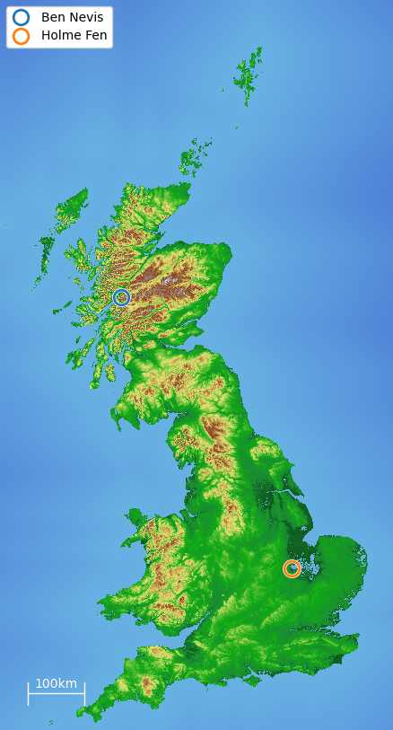

# Where is Ben Nevis?

This repository contains the first files for a fun(?) project that tests optimisation methods on Ordnance Survey (OS) data for Great Britain.

## Requirements

Python 3.5 or higher, with numpy and matplotlib.

When first run, this script will download the data from the OS (about 160MB) and then convert it to a NumPy array stored on disk (about 1.5GB).

## Usage

Run `plot_gb.py`.
Don't worry, it'll be a lot faster the 2nd time.

The amount of downscaling can be set using the variable ``downsampling``.
An example with ``downsampling=32`` is shown below.

